# Tubby

<p align=center>

  

  <br>
  <span>A utility for the <a href="https://genshin-impact.fandom.com/wiki/Housing">Genshin Impact Housing system</a>.</span>
  <br>
  
  <a target="_blank" href="https://pypi.python.org/pypi/tubby/"></a>
  <a target="_blank" href="https://github.com/kelvindecosta/tubby/blob/master/LICENSE" title="License: MIT"></a>
</p>

<p align="center">
  <a href="#installation">Installation</a>
  &nbsp;&nbsp;&nbsp;|&nbsp;&nbsp;&nbsp;
  <a href="#usage">Usage</a>
  &nbsp;&nbsp;&nbsp;|&nbsp;&nbsp;&nbsp;
  <a href="#workflow">Workflow</a>
  &nbsp;&nbsp;&nbsp;|&nbsp;&nbsp;&nbsp;
  <a href="https://github.com/kelvindecosta/tubby/blob/master/CONTRIBUTING.md">Contributing</a>
</p>

## Installation

```bash
pip install tubby
```

> ### Verification
>
> To verify that Tubby is installed, run:
>
> ```bash
> python -c "import tubby"
> ```

## Usage

Run the following command to display a helpful message:

```bash
tubby -h
```

```
Usage: tubby [options] <command> [Args]

  A utility for the Genshin Impact Housing system

Options:
  -h, --help  Show this message and exit.

Commands:
  analyze   Performs analysis on inventory
  backup    Creates or loads inventory backup
  download  Downloads housing metadata
  info      Displays package information
  manage    Manages inventory
  reset     Resets inventory
```

## Workflow

### `download` metadata from the Genshin Impact Wiki

Tubby scrapes the [Wiki](https://genshin-impact.fandom.com/wiki/Genshin_Impact_Wiki) and collects relevant metadata for the housing sets and furnishings.

```bash
tubby download
```

```
Refreshing sources...

Gathering 342 Furnishings...
100%|█████████████████████████████████████████████████████████████████████████████| 342/342 [01:56<00:00,  2.93page/s]

Gathering 45 Sets...
100%|███████████████████████████████████████████████████████████████████████████████| 45/45 [00:16<00:00,  2.72page/s]

Housing metadata updated!
```

---

### `manage` your inventory

Start tracking your in-game inventory of characters, materials, furnishings and sets.

```bash
tubby manage
```

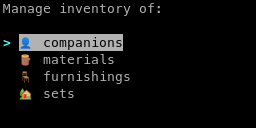

<details>

<summary>Companions</summary>

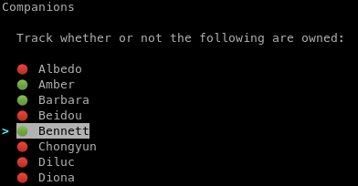

</details>

<details>

<summary>Materials</summary>

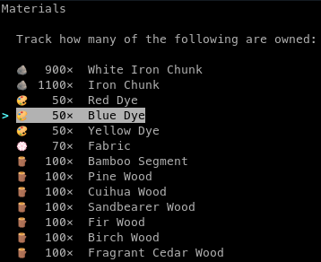

</details>

<details>

<summary>Furnishings</summary>

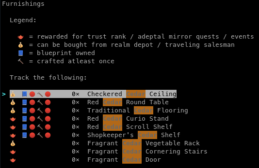

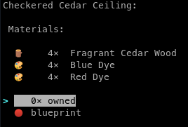

</details>

<details>

<summary>Sets</summary>

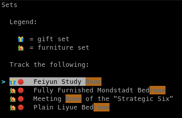

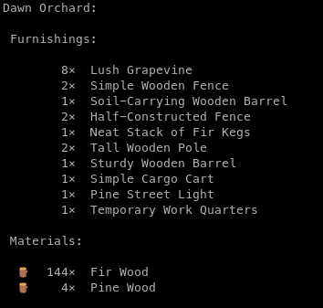

</details>

> To navigate between the menus, use:
>
> - <kbd>Enter</kbd> to select an option,
> - <kbd>↑</kbd> & <kbd>↓</kbd> to cycle through the options,
> - <kbd>/</kbd> to open a search prompt, and
> - <kbd>Esc</kbd> to return to the previous menu/ quit.

---

### `analyze` your inventory

Find out how many of which resources (materials, currency, missing furnishings, etc.) are required to meet certain milestones.

```bash
tubby analyze
```

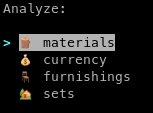

<details>

<summary>Materials</summary>

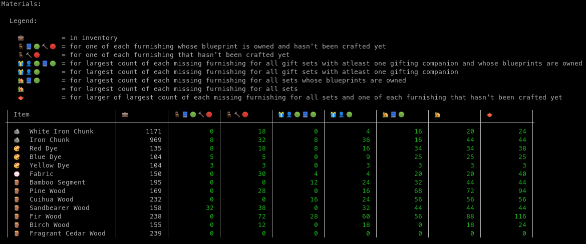

</details>

<details>

<summary>Currency</summary>


</details>

<details>

<summary>Furnishings</summary>

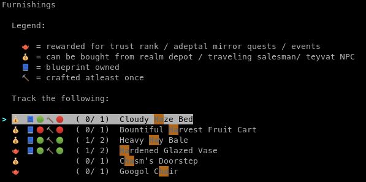

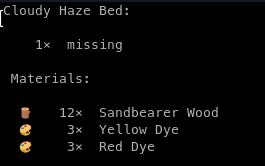

</details>

<details>

<summary>Sets</summary>

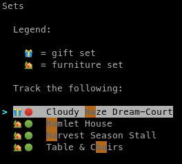

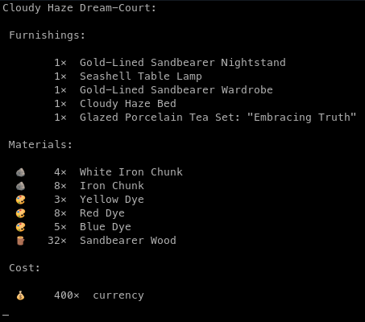

</details>

---

### import / export `backup` inventory data

Create backups of the information saved with Tubby and export them later.

<details>

<summary>Import backup from file</summary>

```bash
tubby backup -i backup/my_inventory.json
```

```
Are you sure you want to import inventory from 'backup/my_inventory.json'? [y/N]: y
Imported backup!
```

</details>

<details>

<summary>Export backup to file</summary>

```bash
tubby backup -e backup/my_inventory.json
```

```
Are you sure you want to export inventory to 'backup/my_inventory.json'? [y/N]: y
Exported backup!
```

</details>

> Tubby uses `.json` files for storing data.

---

### `reset` data

Deletes information loaded into Tubby.

```bash
tubby reset
```

```
Are you sure you want to delete your inventory? [y/N]: y
Deleted inventory!
```

> This resets only the inventory data.
> Metadata is not deleted.

## Contributing

Do you have a feature request, bug report, or patch? Great! Check out the [contributing guidelines](https://github.com/kelvindecosta/tubby/blob/master/CONTRIBUTING.md)!

## License

Copyright (c) 2020 Kelvin DeCosta. Released under the MIT License. See [LICENSE](https://github.com/kelvindecosta/tubby/blob/master/LICENSE) for details.

This project is not affiliated with or endorsed by miHoYo.
Genshin Impact and miHoYo are trademarks or registered trademarks of miHoYo.
Genshin Impact © miHoYo.
